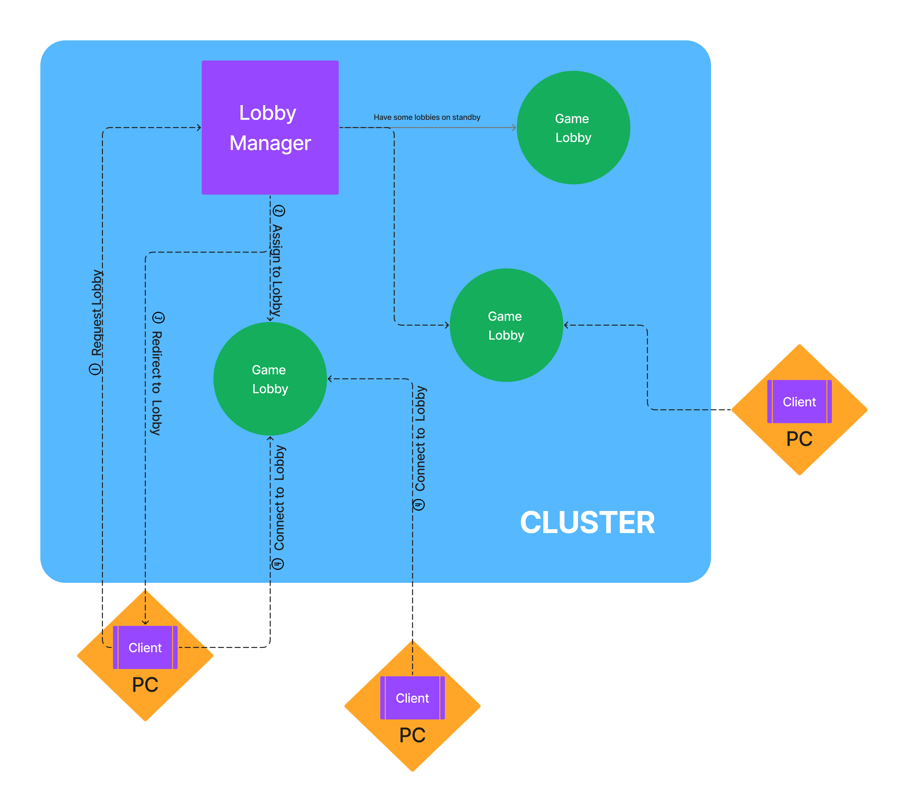

# Inside the Box

This repo contains everything required to develop, build and deploy the authoritative server that makes the game work.

## Proposed Architecture

### Lobby Manager
The lobby manager handles the lifecyle of game lobbies. It also handles client ingress. The first point of contact of a client is the Lobby Manager. When the client creates a new lobby, the lobby manager assigns a game lobby from a pool of game lobbies and redirects the client to the newly assigned game lobby. When a game lobby is no longer in use, the lobby manager either destroys or adds the lobby back to the pool of game lobbies. The Lobby Manager is also responsible to ensure that there are enough lobbies in the pool so that clients can quickly get a game lobby.
### Game Lobby

### Client
The client is the interface with which a player interacts with the game and server. Its main responsiblity is to send player requests to the server and receive responses. The player can request a game lobby via the client, or can connect to a lobby immediately if they have a code.

## Develop
The server is still in very early development. To make changes, edit/create files in the `./src` directory and the `./manifests` directory. Refer to the [proposed architecture](#proposed-architecture) to get a feel of the devlopment path. 
## Build
### Build for Local
To build the server as a binary executable, run `make build`. The executable binary will be built and stored at `./bin/box-server`. 
### Build Container
To build the server, run `make build-image`. This will build an image tagged as `ofarag/box-server:latest`. Alternatively, run `docker build --tag <whatever name you want> . --network=host` which will build the image `<whatever name you want>:latest`
## Deploy
### Local
To run the server executable, run the executable that was created [here](#build-for-local). The server will start listening on the port defined in [the deployment yaml](manifests/echo-deployment.yaml) under the `spec.template.spec.containers.containerPort` field. It is currently set to listen on port `8080`.
```
[ofarag@fedora box-server]$ ./bin/box-server 
Listening on port 8080...
```
to check if the server is handling connections, open a new terminal and curl the server
```
[ofarag@fedora box-server]$ curl -X POST localhost:8080 -H "Content-Type: text/plain" --data "hassam"
Hello hassam
```
### Container
To run the server as a container, run `make run-image`. This will run the image built by the default instructions [here](#build-container). If you used a different name for the image, run `docker run -p 8080:8080 <whatever name you used>:latest`. Note the `-p` option, specifying to publish port `8080` on the docker container and map it to our machine at port `8080`. For more information, check out [the documentation](https://docs.docker.com/engine/reference/commandline/run/#publish).
```
[ofarag@fedora box-server]$ make run-image
docker run -p 8080:8080 ofarag/box-server:latest
Listening on port 8080...
```
to check if the container is handling connections, open a new terminal and curl the server
```
[ofarag@fedora box-server]$ curl -X POST localhost:8080 -H "Content-Type: text/plain" --data "taha"
Hello taha
```
### Kubernetes
To do